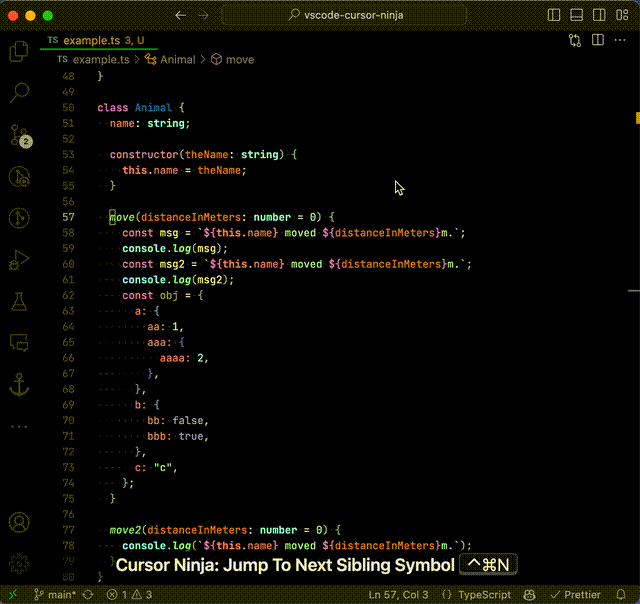

# Cursor Ninja

Move the cursor like a ninja 🥷.

## Motivation

Have you ever wanted to jump to the next/previous function, class or variable?  
I have.

## Demo

- `jumpToNextSiblingSymbol`
- `jumpToPreviousSiblingSymbol`
- `jumpToFirstSiblingSymbol`
- `jumpToLastSiblingSymbol`
- `jumpToNextSymbol`
- `jumpToPreviousSymbol`

## Keyboard Shortcuts

This extension does not include any keyboard shortcuts. You can set your own keyboard shortcuts if you want.
